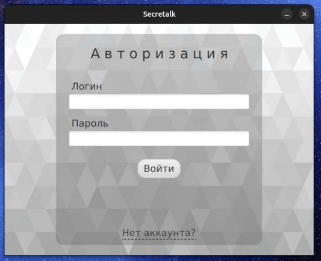
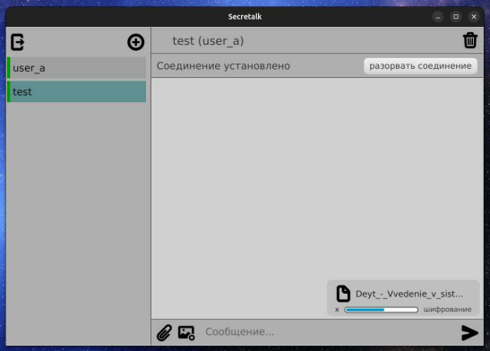

# Secretalk
Secretalk &mdash; мессенджер с end-to-end шифрованием.

Для шифрования используются симметричные алгоритмы DES, DEAL, MAGENTA, Serpent в одном из семи режимов сцепления блоков 
шифротекста (ECB, CBC, PCBC, CFB, OFB, CTR, RD) с одним из четырёх режимов набивки (Zeros, ANSI X.923, PKCS7, ISO 
10126). Конфигурация шифрования определяется пользователем для каждого чата при его создании. Общий ключ 
симметричных алгоритмов распределяется по протоколу Диффи-Хеллмана.

### Frontend
Клиент реализован в виде настольного приложения на JavaFX и Spring Boot.

Пользователь может
* Авторизоваться или зарегистрировать новый аккаунт;
* Создать чат с выбранной конфигурацией, отправив приглашение собеседнику;
* Принять приглашение начать чат (или возобновить);
* Завершить сессию общения;
* Удалить чат для себя или для обоих собеседников;
* Отправить текстовое сообщение, к которому может быть прикреплён файл или изображение.

Конфигурация чатов и история сообщений сохраняются в локальном файловом хранилище (протестировано только на Linux).

### Backend
Backend состоит HTTP-сервера на Spring Boot, СУБД PostgreSQL для хранения учётных данных пользователей и брокера 
сообщений NATS для хранения ещё недоставленных сообщений.